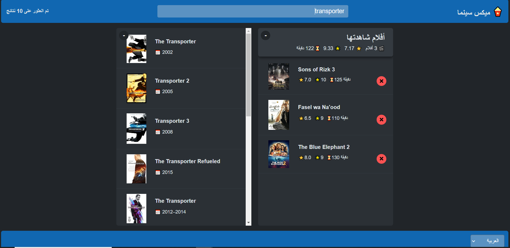
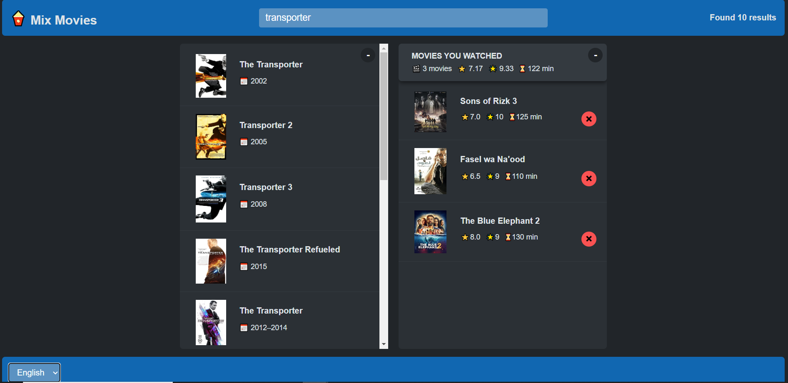

# Mix Movies



## 📋 Overview

**Mix Movies** is a react application that provides users with a way to explore movies, rate them, and manage their watched movies list. By using OMDB API (Open Movie Database), the app gains access to an extensive movie database, allowing users to quickly and easily find movie information, including genre, cast, director, ratings, and much more.

## 🔑 Key Features

- 🔍 **Search Bar**: Users can search for movies using keywords.
- 📋 **Movie List**: Displays a list of movies based on the user search query.
- 🎞️ **Movie Details**: Users can select a specific movie to view its IMDb rating, runtime, and other details.
- ⭐ **User Ratings**: Users have the ability to rate movies they have watched.
- ✅ **Watchlist**: Users can create a personal watchlist of movies they plan to watch or have already watched.
- 📊 **User Statistics**: The application displays the users average rating, the number of movies they have rated, and the number of movies they have watched.

Whether you're a movie lover or just looking for something to watch tonight, Mix Movies gives you a simple and interactive platform to discover and organize your film experience.

## 🚀 Demo

View the live demo of the app: [Mix Movies](https://mix-movies-cima.netlify.app)



## 🛠️ Technologies Used

- **React**: A JavaScript library for building user interfaces.
- **React Hooks**: Utilized `useState` for managing component state without writing class components and `useEffect` for handling side effects.
- **OMDB API**: Used API requests to retrieve movie data and ratings.
- **HTML / CSS**: Structured the app layout and applied styling for an appealing user interface.
- **Netlify**: For deployment.

## 📦 Setup Instructions

1. Clone the repository:
   ```bash
   git clone https://github.com/hazemhesham-1/mix-movies.git
   ```
2. Navigate to the project directory:
   ```bash
   cd mix-movies
   ```
3. Install dependencies:
   ```bash
   npm install
   ```
4. Start the development server:
   ```bash
   npm start
   ```
5. Open [http://localhost:3000](http://localhost:3000) in your browser to view the app.
